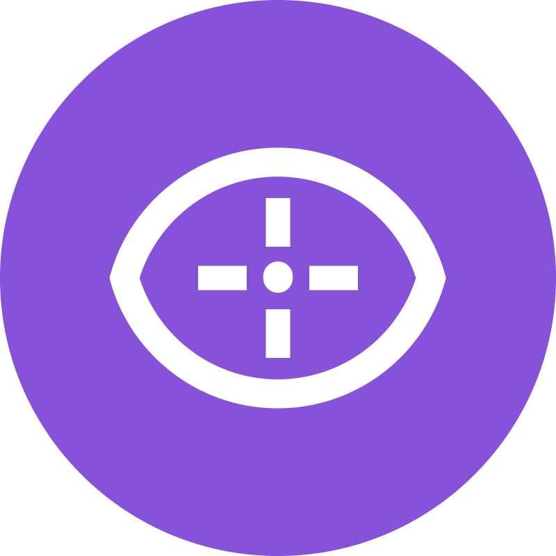
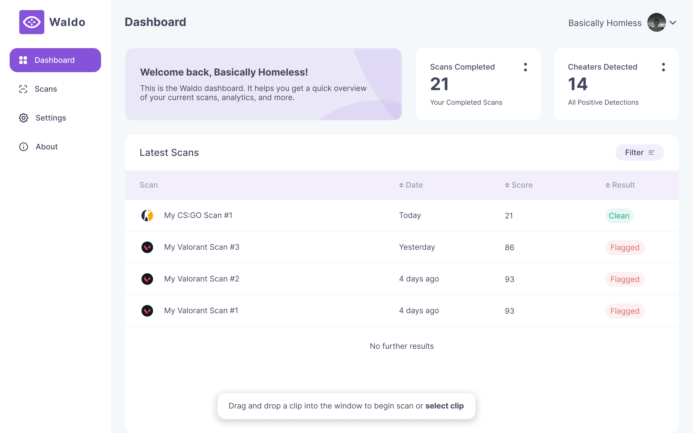

<!-- Top link: reference at <a href='#top'> -->

<!-- PROJECT SHIELDS -->

[![Contributors][contributors-shield]][contributors-url]
[![Forks][forks-shield]][forks-url]
[![Stargazers][stars-shield]][stars-url]
[![Issues][issues-shield]][issues-url]
[![MIT License][license-shield]][license-url]

<!-- PROJECT LOGO -->
 

  

  <h3 align="center">Waldo Vision</h3>

  

    An awesome community driven cheat detection software powered by deep learning!
     
    <a href="https://docs.waldo.vision"><strong>Explore the docs »</strong></a>
     
     
    <a href="https://github.com/waldo-vision/waldo/discussions">Discussions</a>
    ·
    <a href="https://github.com/waldo-vision/waldo/issues">Report Bug</a>
    ·
    <a href="https://github.com/waldo-vision/waldo/issues">Request Feature</a>
  

<!-- TABLE OF CONTENTS -->

  
Table of Contents

  <ol>
    <li>
      <a href="#about-the-project">About The Project</a>
      <ul>
        <li><a href="#built-with">Built With</a></li>
      </ul>
    </li>
    <li>
      <a href="#getting-started">Getting Started</a>
      <ul>
        <li><a href="#prerequisites">Prerequisites</a></li>
        <li><a href="#installation">Installation</a></li>
      </ul>
    </li>
    <li><a href="#usage">Usage</a></li>
    <li><a href="#roadmap">Roadmap</a></li>
    <li><a href="#contributing">Contributing</a></li>
    <li><a href="#license">License</a></li>
    <li><a href="#contact">Contact</a></li>
    <li><a href="#acknowledgments">Acknowledgments</a></li>
  </ol>

<!-- ABOUT THE PROJECT -->

## About The Project

  

Waldo Vision is a machine learning system that will analyze FPS gameplay clips, and return a probability that the player is using aimbot cheats.

Here's why:

- The rise of ‘closet hacking’ poses a significant threat not only to the pastime and community but also to the rapidly growing eSports and streaming industry.
- It ruins the experience of a multiplayer game for others who are playing fairly.
- Cheating breaks the social contract between players and undermine the integrity of the game.

Waldo aims to help game developers and communities detect cheaters more effectively and efficiently. By detecting cheaters more effectively and efficiently, Waldo Vision can help create a fairer and more enjoyable gaming experience for everyone.

(<a href="#top">back to top</a>)

<!-- Built with -->

### Built With

- [![Next][next.js]][next-url]
- [![React][react.js]][react-url]
- [![Typescript][typescript]][typescript-url]
- [![tRPC][trpc]][trpc-url]

(<a href="#readme-top">back to top</a>)

<!-- GETTING STARTED -->

## Getting Started

To get started with this project, follow these steps:

1. Clone this repository
2. Install all dependencies
3. Start the development server

For more detailed instructions, see the [docs]

<!-- CONTRIBUTING -->

## Contributing

Contributions are what make the open source community such an amazing place to learn, inspire, and create. Any contributions you make are **greatly appreciated**.

If you have a suggestion that would make this better, please fork the repo and create a pull request. You can also simply open an issue with the tag "enhancement" and follow the template. Make sure to also read the [code of conduct][coc].
Don't forget to give the project a star! Thanks again!

1. Fork the Project
2. Create your Feature Branch (`git checkout -b feature/AmazingFeature`)
3. Commit your Changes (`git commit -m 'Add some AmazingFeature'`)
4. Push to the Branch (`git push origin feature/AmazingFeature`)
5. Open a Pull Request

(<a href="#readme-top">back to top</a>)

<!-- LICENSE -->

## License

See ["LICENSE.txt"][license-url] for more information.

(<a href="#readme-top">back to top</a>)

<!-- CONTACT -->

## Contact

Waldo Vision - [@waldovision](https://twitter.com/waldovision) - support@waldo.vision

Project Link: [https://github.com/waldo/waldo-vision](https://github.com/waldo/waldo-vision)

(<a href="#readme-top">back to top</a>)

<!-- ACKNOWLEDGMENTS -->

## Acknowledgments

> This project would not have been possible without the help and support of many people. We would like to express our sincere gratitude to everyone who has contributed to this project in one way or another.

- [Img Shields](https://shields.io)
- [GitHub Pages](https://pages.github.com)
- [React Icons](https://react-icons.github.io/react-icons/search)

(<a href="#readme-top">back to top</a>)

<!-- ======================= MARKDOWN LINKS & IMAGES ======================= -->
<!-- General -->

[repo]: https://github.com/waldo-vision/waldo
[docs]: https://docs.waldo.vision
[coc]: https://docs.waldo.vision/legal/code-of-conduct/

<!-- Shields -->

[contributors-shield]: https://img.shields.io/github/contributors/waldo-vision/waldo.svg?style=for-the-badge
[contributors-url]: https://github.com/waldo-vision/waldo/graphs/contributors
[forks-shield]: https://img.shields.io/github/forks/waldo-vision/waldo.svg?style=for-the-badge
[forks-url]: https://github.com/waldo-vision/waldo/network/members
[stars-shield]: https://img.shields.io/github/stars/waldo-vision/waldo.svg?style=for-the-badge
[stars-url]: https://github.com/waldo-vision/waldo/stargazers
[issues-shield]: https://img.shields.io/github/issues/waldo-vision/waldo.svg?style=for-the-badge
[issues-url]: https://github.com/waldo-vision/waldo/issues
[license-shield]: https://img.shields.io/github/license/waldo-vision/waldo.svg?style=for-the-badge
[license-url]: https://github.com/waldo-vision/waldo/blob/master/LICENSE.md

<!-- Built with -->

[next.js]: https://img.shields.io/badge/next.js-000000?style=for-the-badge&logo=nextdotjs&logoColor=white
[next-url]: https://nextjs.org/
[react.js]: https://img.shields.io/badge/React-20232A?style=for-the-badge&logo=react&logoColor=61DAFB
[react-url]: https://reactjs.org/
[typescript]: https://img.shields.io/badge/Typescript-20232A?style=for-the-badge&logo=typescript&logoColor=61DAFB
[typescript-url]: https://github.com/microsoft/TypeScript
[trpc]: https://img.shields.io/badge/Trpc-20232A?style=for-the-badge&logo=trpc&logoColor=61DAFB
[trpc-url]: https://trpc.io

<!-- ======================= END OF MARKDOWN LINKS & IMAGES ======================= -->
